# Modelo de Dados

## Objetivo

Documentar o modelo inicial de dados multi-tenant do Guia Digital RF Tecnologia.

Este documento é conceitual. Não contém SQL executável, migrations ou policies reais.

Princípio permanente:

**Um sistema. Muitos clientes. Experiências completamente personalizadas.**

## Princípios do banco

* PostgreSQL será utilizado através do Supabase.
* UUID deverá ser utilizado como identificador principal.
* Entidades pertencentes a estabelecimentos deverão possuir `tenant_id`.
* Registros deverão possuir timestamps quando fizer sentido.
* Exclusões definitivas devem ser evitadas quando histórico for importante.
* Dados críticos deverão possuir rastreabilidade.
* RLS será parte obrigatória da implementação.
* O frontend nunca poderá decidir sozinho qual tenant pode acessar um registro.

Campos comuns possíveis:

```text
id
tenant_id
created_at
updated_at
created_by
updated_by
is_active
sort_order
```

Esses campos não devem ser adicionados cegamente a todas as tabelas. Devem ser usados conforme responsabilidade, origem e ciclo de vida da entidade.

## Convenções gerais

### Status

Evitar booleanos insuficientes quando um fluxo possuir múltiplos estados.

Status conceituais por contexto:

```text
tenant: draft | active | suspended | archived
conteúdo editorial: draft | published | archived
design visual: draft | published | archived
moderação: pending | approved | rejected
perguntas sem resposta: open | resolved | ignored
membership: invited | active | suspended | removed
job de IA: queued | running | completed | failed | cancelled
```

Não utilizar um enum global gigante para todos os contextos.

### JSONB

Usar JSONB quando:

* configurações forem realmente variáveis;
* metadata for flexível;
* pequenos conjuntos forem específicos de um módulo.

Evitar JSONB quando:

* o dado precisa de filtro frequente;
* existem relacionamentos claros;
* regras de integridade são importantes;
* o campo possui estrutura estável.

O objetivo é aproveitar flexibilidade sem transformar o banco inteiro em documentos soltos.

### Soft delete

Usar `deleted_at` estrategicamente quando histórico, restauração ou auditoria forem importantes.

Entidades que justificam soft delete:

* tenants;
* memberships;
* acomodações;
* serviços;
* mídia;
* regras;
* promoções;
* cupons;
* produtos;
* itens de cardápio;
* conteúdos de hóspedes;
* pontos de acesso.

Entidades operacionais de analytics e logs normalmente não precisam de soft delete; precisam de retenção e arquivamento.

### Auditoria de criação e alteração

Para conteúdo administrativo importante, considerar:

```text
created_by
updated_by
```

Não adicionar cegamente em registros gerados automaticamente, como eventos analíticos.

## Núcleo multi-tenant

### tenants

Representa cada estabelecimento da plataforma.

Campos conceituais:

```text
id: uuid
name: text
slug: text
legal_name: text
document: text
type: text
status: draft | active | suspended | archived
timezone: text
locale: text
currency: text
published_at: timestamptz
created_at: timestamptz
updated_at: timestamptz
deleted_at: timestamptz
```

`type` poderá representar pousada, hotel, chale, resort, hostel, hospedagem_rural ou outro. Recomenda-se manter extensível, sem travar a plataforma para uma lista definitiva.

Tenant suspenso não é tenant excluído. Excluir tenant deve ser um processo controlado, nunca um `CASCADE` amplo e perigoso.

### tenant_domains

Permite URL da plataforma, subdomínio RF e domínio personalizado.

Campos conceituais:

```text
id: uuid
tenant_id: uuid
hostname: text
domain_type: platform_path | rf_subdomain | custom_domain
path_prefix: text
status: pending | verifying | active | failed | disabled
is_primary: boolean
verification_status: pending | verified | failed
verification_method: dns | file | manual
verified_at: timestamptz
created_at: timestamptz
updated_at: timestamptz
```

Não implementa DNS. Apenas modela endereçamento para o `TenantResolver`.

`hostname` deve ser único globalmente quando preenchido. `path_prefix` permite a estratégia `guia.rftecnologia.com.br/cliente`. Um tenant pode ter vários domínios, mas apenas um domínio primário deve ser usado como URL canônica.

Detalhes comerciais e operacionais estão em `docs/PLANOS-E-DOMINIOS.md`.

## Usuários, membros e papéis

Supabase Auth será responsável por autenticação. Não duplicar senha ou credenciais.

Relacionamento conceitual:

```text
auth.users
   ↓
profiles
   ↓
tenant_members
   ↓
tenants
```

### profiles

Informações adicionais do usuário autenticado.

Campos conceituais:

```text
id: uuid
user_id: uuid
full_name: text
avatar_media_id: uuid
phone: text
created_at: timestamptz
updated_at: timestamptz
```

Não colocar um único `tenant_id` fixo em `profiles` como única associação, porque um usuário poderá administrar mais de um estabelecimento.

### tenant_members

Membership entre usuário e tenant.

Campos conceituais:

```text
id: uuid
tenant_id: uuid
user_id: uuid
role: tenant_staff | tenant_admin
status: invited | active | suspended | removed
created_at: timestamptz
updated_at: timestamptz
```

### super_admins

Recomendação: armazenar Super Admin RF Tecnologia fora de `tenant_members`, em uma estrutura própria e restrita.

Campos conceituais:

```text
id: uuid
user_id: uuid
status: active | suspended
created_at: timestamptz
```

Isso evita simular `super_admin` como membro comum de todos os tenants e torna a separação de privilégios mais clara.

Permissões granulares poderão ser adicionadas futuramente com tabelas como `permissions`, `role_permissions` ou `member_permissions`, sem bloquear o MVP.

## Auditoria

### audit_logs

Registra ações administrativas importantes.

Campos conceituais:

```text
id: uuid
tenant_id: uuid
user_id: uuid
action: text
entity_type: text
entity_id: uuid
metadata: jsonb
created_at: timestamptz
```

Eventos exemplos:

```text
wifi.updated
rule.deleted
promotion.created
tenant.suspended
member.invited
```

Não registrar segredos desnecessariamente em logs, como senhas de Wi-Fi, tokens ou chaves privadas.

## Configurações do tenant

### tenant_settings

Configurações globais que não justificam tabela especializada.

Campos conceituais:

```text
tenant_id: uuid
timezone: text
locale: text
currency: text
contact_preferences: jsonb
guest_experience_settings: jsonb
created_at: timestamptz
updated_at: timestamptz
```

Evitar uma tabela gigantesca com centenas de colunas. Configurações com domínio próprio devem ter tabela específica.

### tenant_branding

Identidade visual por tenant.

Campos conceituais:

```text
tenant_id: uuid
logo_media_id: uuid
logo_dark_media_id: uuid
icon_media_id: uuid
primary_color: text
secondary_color: text
accent_color: text
background_color: text
surface_color: text
foreground_color: text
muted_color: text
border_color: text
font_heading: text
font_body: text
border_radius: text
shadow_style: text
hero_media_id: uuid
splash_media_id: uuid
created_at: timestamptz
updated_at: timestamptz
```

`custom_css` não deverá existir inicialmente. É mais seguro priorizar tokens controlados pela plataforma. CSS customizado pode gerar risco de segurança, inconsistência visual e complexidade de suporte.

### design_templates

Catálogo global mantido pela RF Tecnologia.

Campos conceituais:

```text
id: uuid
key: text
name: text
description: text
default_tokens: jsonb
default_home_sections: jsonb
default_navigation: jsonb
available_variants: jsonb
is_active: boolean
created_at: timestamptz
updated_at: timestamptz
```

Templates representam pontos de partida, não designs rígidos. Exemplos conceituais:

```text
natureza-premium
luxo
rustico
praia
minimalista
contemporaneo
```

Como essa é uma estrutura global da plataforma, parte das definições também poderá existir como catálogo tipado no código. O banco deve registrar templates e defaults administráveis pela RF Tecnologia quando fizer sentido.

### design_presets

Presets reutilizáveis para gerar a configuração inicial de um tenant.

Campos conceituais:

```text
id: uuid
design_template_id: uuid
key: text
name: text
description: text
tokens_snapshot: jsonb
home_sections_snapshot: jsonb
navigation_snapshot: jsonb
is_active: boolean
created_at: timestamptz
updated_at: timestamptz
```

Ao aplicar um preset em um tenant, os valores devem ser copiados para as configurações do tenant como snapshot. Alterar um preset global depois não deve obrigatoriamente modificar clientes já publicados.

### tenant_design_settings

Configura layout e comportamento visual do tenant, separado de branding.

Campos conceituais:

```text
tenant_id: uuid
design_template_id: uuid
applied_preset_id: uuid
status: draft | published
tokens: jsonb
component_variants: jsonb
layout_settings: jsonb
navigation_settings: jsonb
splash_settings: jsonb
created_at: timestamptz
updated_at: timestamptz
published_at: timestamptz
```

`tenant_branding` representa marca. `tenant_design_settings` representa layout, variantes, densidade visual, navegação, splash e comportamento visual.

Tokens e variantes em JSONB são aceitáveis aqui porque representam configurações variáveis e controladas da UI. Não usar JSONB para substituir tabelas de conteúdo estruturado.

### tenant_design_versions

Versiona configurações visuais do tenant.

Recomendação: incluir conceitualmente para permitir draft, preview, comparação, publicação controlada e histórico de propostas geradas por IA.

Campos conceituais:

```text
id: uuid
tenant_id: uuid
version: integer
source: manual | ai | preset
status: draft | published | archived
design_config: jsonb
created_by: uuid
created_at: timestamptz
published_at: timestamptz
```

`design_config` deve armazenar configuração validada contra schema da plataforma. Não deve conter HTML livre, CSS arbitrário, JavaScript, prompts gigantes ou dados sensíveis desnecessários.

Uma nova proposta de IA deve criar uma versão `draft`. Ela nunca deve sobrescrever automaticamente uma versão `published`.

### ai_design_jobs

Registra execuções mínimas do AI Designer.

Campos conceituais:

```text
id: uuid
tenant_id: uuid
status: queued | running | completed | failed | cancelled
requested_by: uuid
input_summary: jsonb
result_version_id: uuid
created_at: timestamptz
completed_at: timestamptz
error: text
```

Não armazenar prompt gigante, mídia bruta ou dados sensíveis sem necessidade. `input_summary` deve conter apenas resumo operacional seguro.

O job deve respeitar isolamento multi-tenant. Execuções do Tenant A não podem utilizar conteúdo privado, mídia privada ou configurações privadas do Tenant B.

### AI Design Spec

A `AI Design Spec` não precisa ser uma tabela própria. Ela é uma estrutura validada que pode ser salva dentro de `tenant_design_versions.design_config` após passar pelo Schema Validator.

Ela poderá conter:

```text
template
branding
tokens
hero
cards
navigation
sections
component_variants
layout_settings
```

Somente valores permitidos pela plataforma poderão ser aceitos.

### tenant_pwa_settings

Configurações do PWA por tenant.

Campos conceituais:

```text
tenant_id: uuid
name: text
short_name: text
description: text
icon_media_id: uuid
theme_color: text
background_color: text
display: text
install_prompt_enabled: boolean
offline_enabled: boolean
created_at: timestamptz
updated_at: timestamptz
```

Não duplicar branding desnecessariamente. Quando possível, usar fallback de `tenant_branding`.

## Módulos e Home

### modules

Catálogo global de módulos.

Campos conceituais:

```text
id: uuid
key: text
name: text
description: text
is_active: boolean
created_at: timestamptz
```

Exemplos:

```text
wifi
accommodations
services
gallery
events
promotions
coupons
shop
minibar
restaurant
concierge
guest_experiences
```

### tenant_modules

Configuração de módulos por tenant.

Campos conceituais:

```text
id: uuid
tenant_id: uuid
module_id: uuid
enabled: boolean
sort_order: integer
settings: jsonb
created_at: timestamptz
updated_at: timestamptz
```

`settings` pode ser JSONB para opções pequenas e variáveis por módulo. Dados estruturais do módulo devem ter tabelas próprias.

Um módulo pode depender de uma feature comercial. A disponibilidade final deve considerar:

```text
feature permitida pelo entitlement
+ tenant_modules habilitado
= módulo disponível
```

Feature não é módulo. Entitlement não é autorização.

## Planos, features e entitlements

Esta seção modela capacidade comercial. Não implementa billing, checkout ou cobrança automática.

Documentação complementar:

```text
docs/PLANOS-E-DOMINIOS.md
```

### plans

Catálogo comercial de planos.

```text
id: uuid
key: text
name: text
description: text
status: active | archived
metadata: jsonb
created_at: timestamptz
updated_at: timestamptz
```

### features

Catálogo global de capacidades de produto.

```text
id: uuid
key: text
name: text
description: text
category: text
status: active | archived
default_limits: jsonb
created_at: timestamptz
updated_at: timestamptz
```

Exemplos:

```text
pwa
ai_designer
concierge
custom_domain
advanced_gallery
promotions
guest_experiences
```

### plan_features

Define features e limites incluídos em cada plano.

```text
id: uuid
plan_id: uuid
feature_id: uuid
enabled: boolean
limits: jsonb
created_at: timestamptz
updated_at: timestamptz
```

### tenant_subscriptions

Associação do tenant ao plano vigente.

```text
id: uuid
tenant_id: uuid
plan_id: uuid
status: trialing | active | suspended | cancelled
started_at: timestamptz
ended_at: timestamptz
metadata: jsonb
created_at: timestamptz
updated_at: timestamptz
```

Não representa billing completo.

### tenant_feature_overrides

Exceções, extras e bloqueios por tenant.

```text
id: uuid
tenant_id: uuid
feature_id: uuid
enabled: boolean
limits: jsonb
reason: text
source: manual | contract | migration | support
starts_at: timestamptz
ends_at: timestamptz
created_by: uuid
created_at: timestamptz
updated_at: timestamptz
```

### TenantEntitlementResolver

Camada conceitual, não tabela.

```text
plans
  ↓
plan_features
  ↓
tenant_subscriptions
  ↓
tenant_feature_overrides
  ↓
entitlements finais do tenant
```

Componentes, serviços e rotas devem consultar capacidades resolvidas, não nomes comerciais de plano.

### Refinamento real do Passo 6

A primeira migration real `create_platform_core` implementa o núcleo com pequenas decisões de MVP:

* `plans.status` aceita `draft`, `active` e `archived`;
* `features` usa `key`, `name`, `description`, `status` e `sort_order`, sem `category` e `default_limits` nesta etapa;
* limites simples usam `limit_value` em `plan_features` e `tenant_feature_overrides`;
* `tenant_subscriptions` usa `starts_at` e `ends_at`;
* não há tabela materializada de entitlements;
* catálogo técnico inicial de `features` e `modules` é inserido pela migration por representar capacidade da plataforma, não dado de cliente;
* nenhuma tabela de conteúdo foi criada nesta migration.

## Conteúdo essencial do Guia

A segunda migration real `create_guide_core_content` adiciona somente o conteúdo essencial administrável do Guia.

Estratégia editorial:

* conteúdo público/editorial usa `status = draft | published | archived`;
* `is_active` só aparece onde significa configuração operacional, como `booking_settings`;
* mídia usa `status = draft | ready | published | archived`, pois pode ser asset ainda não associado a uma publicação;
* `deleted_at` aparece em entidades com maior chance de recuperação/histórico;
* anon não recebe SELECT direto nessas tabelas nesta etapa.

Estratégia monetária:

* preços usam `numeric(12,2)`;
* não há motor de preços;
* `price_type` suporta `fixed`, `starting_from`, `upon_request` e `free`.

Estratégia cross-tenant:

* relações entre entidades de tenant usam FKs compostas com `(tenant_id, id)`;
* isso impede associar Acomodação A com Mídia B, Comodidade B, Categoria B ou Dica B;
* a proteção não depende do formulário do frontend.

Tabelas criadas:

```text
media
accommodations
amenities
accommodation_amenities
accommodation_media
services
schedules
schedule_periods
wifi_networks
rules
contacts
gallery_categories
gallery_items
local_tip_categories
local_tips
booking_settings
```

### media

Metadata da biblioteca de mídia. Não cria bucket, upload ou signed URL.

Campos reais principais:

```text
id
tenant_id
media_type
storage_bucket
storage_path
original_filename
mime_type
size_bytes
width
height
duration_seconds
alt_text
caption
status
created_by
updated_by
created_at
updated_at
deleted_at
```

Refinamento real do Passo 8:

* buckets criados por migration: `tenant-private-media` e `tenant-public-media`;
* `storage_bucket` deve ser um desses buckets;
* `storage_path` segue `{tenant_id}/{category}/{uuid}.{ext}`;
* bucket privado guarda drafts, uploads e previews administrativos;
* bucket público guarda apenas assets publicados;
* signed URLs nunca são persistidas.

### Conteúdo com publicação

As tabelas abaixo usam `draft | published | archived`:

```text
accommodations
amenities
services
schedules
rules
contacts
gallery_categories
gallery_items
local_tip_categories
local_tips
```

### Horários

Horários usam:

```text
schedules
schedule_periods
```

`schedule_periods` suporta múltiplos intervalos por dia com `day_of_week`, `opens_at`, `closes_at`, `is_closed`, `label` e `sort_order`.

Exceções de feriado/calendário continuam futuras.

### Wi-Fi

`wifi_networks.password` é sensível.

Nesta etapa:

* Tenant Admin e Super Admin podem gerenciar Wi-Fi;
* Tenant Staff não edita senha;
* anon não recebe SELECT direto;
* a futura superfície pública deverá ser controlada e não cachear senha offline.

### Reservas externas

`booking_settings` prepara link externo por tenant com `provider`, `external_url`, `open_mode`, `button_label` e `is_active`.

Não há motor próprio de reservas nem integração com fornecedor externo nesta etapa.

### tenant_home_sections

Permite organizar a Home sem alteração de código.

Campos conceituais:

```text
id: uuid
tenant_id: uuid
section_type: hero | welcome | quick_actions | stay_summary | accommodations | services | gallery | promotion | events | local_tips | testimonial | custom_content | concierge_cta | booking_cta
variant: text
title: text
subtitle: text
enabled: boolean
sort_order: integer
content_source: text
settings: jsonb
style_overrides: jsonb
created_at: timestamptz
updated_at: timestamptz
```

`tenant_home_sections` é um construtor controlado de seções. Não é page builder livre.

O administrador poderá adicionar, remover, ativar, desativar, reorganizar, selecionar variante, editar conteúdo, selecionar fonte de dados e alterar configurações permitidas.

### section_definitions

Recomendação: não criar tabela no MVP. Manter como catálogo tipado no código, pois representa estrutura da plataforma.

Cada definição deverá conhecer:

```text
section_type
available_variants
allowed_settings
supported_content_sources
```

Escolhas do cliente ficam no banco em `tenant_home_sections`.

### component_registry

Recomendação: não criar tabela no MVP. Manter como catálogo tipado no código, pois representa contratos estruturais da plataforma para componentes, variantes, propriedades permitidas e compatibilidade mobile.

O AI Designer deverá consultar esse catálogo conceitual antes de propor `AI Design Spec`.

### tenant_navigation

Configuração da navegação por tenant.

Campos conceituais:

```text
id: uuid
tenant_id: uuid
label: text
icon: text
destination_type: module | entity | url | path
destination: text
position: integer
enabled: boolean
highlighted: boolean
settings: jsonb
created_at: timestamptz
updated_at: timestamptz
```

Limitar a quantidade de itens para preservar usabilidade mobile.

### quick_actions

Acessos rápidos configuráveis.

Campos conceituais:

```text
id: uuid
tenant_id: uuid
title: text
subtitle: text
icon: text
destination_type: module | entity | url | path
destination: text
enabled: boolean
sort_order: integer
style: jsonb
created_at: timestamptz
updated_at: timestamptz
```

## Mídia e Storage

### media

Biblioteca central de mídia.

Campos conceituais:

```text
id: uuid
tenant_id: uuid
type: image | video | document
storage_path: text
original_filename: text
mime_type: text
size: integer
width: integer
height: integer
duration: integer
alt_text: text
caption: text
status: draft | published | archived
created_by: uuid
created_at: timestamptz
updated_at: timestamptz
deleted_at: timestamptz
```

Não armazenar arquivo binário diretamente no PostgreSQL. O banco guarda metadados, propriedade e `storage_path`; o Supabase Storage guarda o arquivo real.

Organização conceitual:

```text
tenants/{tenant_id}/branding/
tenants/{tenant_id}/accommodations/
tenants/{tenant_id}/gallery/
tenants/{tenant_id}/services/
tenants/{tenant_id}/products/
tenants/{tenant_id}/guest-uploads/
```

## Conteúdo principal

### accommodations

Campos conceituais:

```text
id: uuid
tenant_id: uuid
name: text
slug: text
short_description: text
description: text
capacity: integer
cover_media_id: uuid
booking_url: text
status: draft | published | archived
sort_order: integer
created_at: timestamptz
updated_at: timestamptz
deleted_at: timestamptz
```

Não colocar todos os possíveis atributos de hospedagem nessa tabela. Detalhes específicos podem evoluir para tabelas próprias ou configurações controladas.

### amenities

Comodidades reutilizáveis dentro do tenant.

Campos conceituais:

```text
id: uuid
tenant_id: uuid
name: text
icon: text
is_active: boolean
sort_order: integer
created_at: timestamptz
updated_at: timestamptz
```

### accommodation_amenities

Relaciona acomodações e comodidades.

```text
accommodation_id: uuid
amenity_id: uuid
sort_order: integer
```

### accommodation_media

Relaciona acomodações e mídia.

```text
accommodation_id: uuid
media_id: uuid
sort_order: integer
is_cover: boolean
```

Não criar campos como `image1`, `image2`, `image3`.

### services

Campos conceituais:

```text
id: uuid
tenant_id: uuid
name: text
short_description: text
description: text
price: numeric
price_type: free | fixed | from | upon_request
requires_booking: boolean
booking_url: text
contact_action: text
status: draft | published | archived
sort_order: integer
created_at: timestamptz
updated_at: timestamptz
deleted_at: timestamptz
```

Preço é opcional. Nem todo serviço precisa ter preço.

### schedules

Horários usados pelo Guia e Concierge.

Solução equilibrada para a primeira versão:

```text
id: uuid
tenant_id: uuid
entity_type: tenant | service | accommodation | custom
entity_id: uuid
title: text
description: text
schedule_type: fixed_text | weekly_intervals
display_text: text
is_active: boolean
sort_order: integer
created_at: timestamptz
updated_at: timestamptz
```

Para intervalos semanais:

### schedule_intervals

```text
id: uuid
schedule_id: uuid
weekday: integer
opens_at: time
closes_at: time
sort_order: integer
```

Para exceções simples:

### schedule_exceptions

```text
id: uuid
schedule_id: uuid
date: date
is_closed: boolean
opens_at: time
closes_at: time
note: text
```

Isso suporta horários fixos, vários intervalos, dias da semana, exceções e texto complementar sem criar complexidade excessiva.

### wifi_networks

Campos conceituais:

```text
id: uuid
tenant_id: uuid
name: text
ssid: text
password: text
area: text
accommodation_id: uuid
is_guest_visible: boolean
is_active: boolean
sort_order: integer
created_at: timestamptz
updated_at: timestamptz
```

Senha de Wi-Fi é sensível. Deve haver cuidado com cache/offline e exposição pública. A senha pode ser exibida ao hóspede que acessa o Guia correto, sem exigir login em todos os cenários, mas nunca deve ser consultável globalmente ou indexada fora do tenant.

### rules

Campos conceituais:

```text
id: uuid
tenant_id: uuid
category: checkin | checkout | pets | silence | visitors | parking | children | cancellation | safety | general
title: text
content: text
severity: info | warning | important
is_featured: boolean
is_active: boolean
sort_order: integer
created_at: timestamptz
updated_at: timestamptz
deleted_at: timestamptz
```

### contacts

Campos conceituais:

```text
id: uuid
tenant_id: uuid
type: phone | whatsapp | email | instagram | website | reception | emergency
label: text
value: text
description: text
is_primary: boolean
is_emergency: boolean
is_active: boolean
sort_order: integer
created_at: timestamptz
updated_at: timestamptz
```

Não assumir que telefone e WhatsApp são sempre o mesmo número.

## Galeria e região

### gallery_categories

```text
id: uuid
tenant_id: uuid
name: text
sort_order: integer
is_active: boolean
```

### gallery_items

```text
id: uuid
tenant_id: uuid
category_id: uuid
media_id: uuid
caption: text
is_featured: boolean
is_active: boolean
sort_order: integer
created_at: timestamptz
updated_at: timestamptz
```

### local_tip_categories

```text
id: uuid
tenant_id: uuid
name: text
sort_order: integer
is_active: boolean
```

### local_tips

```text
id: uuid
tenant_id: uuid
category_id: uuid
name: text
description: text
address: text
latitude: numeric
longitude: numeric
distance_text: text
phone: text
whatsapp: text
website: text
instagram: text
opening_hours_text: text
recommended: boolean
cover_media_id: uuid
sort_order: integer
status: draft | published | archived
created_at: timestamptz
updated_at: timestamptz
```

Dicas da região são cadastradas pelo estabelecimento. Não depender permanentemente de APIs externas para existir.

## Comercial e experiências

### booking_settings

Na primeira versão, não desenvolver motor de reservas próprio.

```text
tenant_id: uuid
provider: text
external_url: text
open_mode: same_tab | new_tab | embedded
button_label: text
is_active: boolean
created_at: timestamptz
updated_at: timestamptz
```

### events

```text
id: uuid
tenant_id: uuid
title: text
description: text
start_at: timestamptz
end_at: timestamptz
location_name: text
address: text
latitude: numeric
longitude: numeric
price: numeric
external_url: text
cover_media_id: uuid
status: draft | published | archived
created_at: timestamptz
updated_at: timestamptz
```

Expiração pode ocorrer na camada de consulta, sem necessariamente alterar o registro.

### promotions

```text
id: uuid
tenant_id: uuid
title: text
description: text
start_at: timestamptz
end_at: timestamptz
cover_media_id: uuid
cta_label: text
cta_url: text
status: draft | published | archived
created_at: timestamptz
updated_at: timestamptz
```

### coupons

```text
id: uuid
tenant_id: uuid
code: text
title: text
description: text
discount_type: percentage | fixed_amount | custom
discount_value: numeric
start_at: timestamptz
end_at: timestamptz
usage_limit: integer
status: draft | published | archived
created_at: timestamptz
updated_at: timestamptz
```

Não implementar motor completo de e-commerce.

Benefício de retorno deve reutilizar `promotions` e/ou `coupons` inicialmente. Criar nova tabela só se surgir regra própria que não caiba nessas estruturas.

### product_categories

```text
id: uuid
tenant_id: uuid
name: text
sort_order: integer
is_active: boolean
```

### products

```text
id: uuid
tenant_id: uuid
category_id: uuid
name: text
description: text
price: numeric
cover_media_id: uuid
stock_control_enabled: boolean
available: boolean
sort_order: integer
created_at: timestamptz
updated_at: timestamptz
```

Produtos podem ser usados por lojinha, frigobar, experiências e serviços adicionais. Não implementar estoque complexo inicialmente.

### menus

```text
id: uuid
tenant_id: uuid
name: text
description: text
is_active: boolean
sort_order: integer
created_at: timestamptz
updated_at: timestamptz
```

### menu_categories

```text
id: uuid
tenant_id: uuid
menu_id: uuid
name: text
sort_order: integer
is_active: boolean
```

### menu_items

```text
id: uuid
tenant_id: uuid
menu_category_id: uuid
name: text
description: text
price: numeric
media_id: uuid
available: boolean
notes: text
dietary_restrictions: jsonb
sort_order: integer
created_at: timestamptz
updated_at: timestamptz
```

Cardápio possui propriedades próprias, por isso justifica estrutura específica em vez de reutilizar apenas `products`.

### guest_experiences

```text
id: uuid
tenant_id: uuid
guest_name: text
caption: text
media_id: uuid
moderation_status: pending | approved | rejected
consent_to_publish: boolean
submitted_at: timestamptz
reviewed_at: timestamptz
reviewed_by: uuid
```

Somente `approved` poderá aparecer publicamente.

## Concierge e conhecimento

O Concierge não terá cópias de Wi-Fi, horários, serviços, regras, produtos, contatos, acomodações ou eventos. Ele deverá consultar essas estruturas. `faqs` e `knowledge_items` são complementares.

### faqs

```text
id: uuid
tenant_id: uuid
question: text
answer: text
category: text
is_active: boolean
sort_order: integer
created_at: timestamptz
updated_at: timestamptz
```

Não armazenar aqui informações estruturadas que já possuam tabela própria. Exemplo incorreto: FAQ contendo senha do Wi-Fi quando existe `wifi_networks`.

### knowledge_items

```text
id: uuid
tenant_id: uuid
title: text
content: text
category: text
keywords: text[]
is_active: boolean
created_at: timestamptz
updated_at: timestamptz
```

Serve para informações complementares que não se encaixem em estruturas próprias.

### concierge_settings

```text
tenant_id: uuid
enabled: boolean
name: text
avatar_media_id: uuid
welcome_message: text
fallback_message: text
handoff_message: text
tone: text
created_at: timestamptz
updated_at: timestamptz
```

Recomendação: modelar perguntas sugeridas em tabela separada, pois precisam de ordenação, ativação e manutenção pelo Admin.

### concierge_suggested_questions

```text
id: uuid
tenant_id: uuid
question: text
destination_type: text
destination_id: uuid
is_active: boolean
sort_order: integer
```

### concierge_conversations

Conversa pode existir para visitante não autenticado.

```text
id: uuid
tenant_id: uuid
session_id: text
guest_user_id: uuid
started_at: timestamptz
ended_at: timestamptz
status: open | closed
```

`session_id` deve ser anônimo e não deve conter dados pessoais desnecessários.

### concierge_messages

```text
id: uuid
conversation_id: uuid
role: guest | assistant | system
content: text
intent: text
source_type: text
source_id: uuid
created_at: timestamptz
```

`source_type` e `source_id` ajudam auditoria das respostas, desde que não exponham dados de outro tenant.

### unanswered_questions

```text
id: uuid
tenant_id: uuid
normalized_question: text
example_question: text
category: text
occurrence_count: integer
first_seen_at: timestamptz
last_seen_at: timestamptz
status: open | resolved | ignored
resolved_by: uuid
resolved_at: timestamptz
```

Preparar mecanismo futuro de agrupamento de perguntas semelhantes. Não implementar IA agora.

## QR, NFC e pontos de acesso

Recomendação: usar uma entidade comum `access_points` com `channel = qr | nfc`.

Motivo: QR e NFC compartilham quase todos os campos e comportamentos. Uma tabela comum evita duplicação, simplifica analytics e permite novos canais no futuro.

Alternativa: `qr_points` e `nfc_points` separados. Essa abordagem só vale se os canais passarem a ter ciclos de vida, integrações ou dados muito diferentes.

### access_points

```text
id: uuid
tenant_id: uuid
channel: qr | nfc
name: text
code: text
point_type: reception | accommodation | restaurant | leisure | keychain | sign | other
location_label: text
destination_type: module | entity | path | url
destination_id: uuid
destination_path: text
is_active: boolean
created_at: timestamptz
updated_at: timestamptz
deleted_at: timestamptz
```

O QR em si poderá ser gerado dinamicamente. Não armazenar necessariamente imagem do QR como dado principal.

## Analytics

### analytics_events

```text
id: uuid
tenant_id: uuid
session_id: text
event_name: text
source: text
module: text
entity_type: text
entity_id: uuid
metadata: jsonb
created_at: timestamptz
```

Exemplos:

```text
guide_opened
qr_opened
nfc_opened
booking_clicked
contact_clicked
module_opened
concierge_opened
pwa_install_prompt
pwa_installed
```

Planejar retenção e privacidade. Não armazenar dados pessoais desnecessários.

## Minha Estadia

### guest_stays

Planejamento futuro para a área Minha Estadia, sem criar PMS completo.

```text
id: uuid
tenant_id: uuid
accommodation_id: uuid
guest_user_id: uuid
guest_name: text
check_in_at: timestamptz
check_out_at: timestamptz
status: expected | checked_in | checked_out | cancelled
external_reference: text
created_at: timestamptz
updated_at: timestamptz
```

Dados de estadia são sensíveis. Exigem policies mais restritas e não devem ficar públicos por slug.

## Futuro planejado

### notifications

FUTURO. Pode suportar avisos ao hóspede, mensagens administrativas e comunicações operacionais.

Não deve bloquear o MVP.

### billing

FUTURO. Pode suportar cobrança, invoices, checkout, gateway de pagamento, contratos, cupons comerciais e histórico financeiro.

Não construir billing nem integrar pagamento nesta etapa.

## Índices conceituais

Prioridade:

```text
tenant_id
slug
status
sort_order
created_at
hostname
feature_id
plan_id
```

Índices compostos comuns:

```text
tenant_id + status
tenant_id + sort_order
tenant_id + slug
tenant_id + is_active
tenant_id + created_at
```

Não escrever SQL nesta etapa.

## Unique constraints conceituais

Restrições globais:

```text
tenants.slug
tenant_domains.hostname
modules.key
features.key
plans.key
design_templates.key
design_presets.key
```

Unicidade relativa ao tenant:

```text
tenant_id + accommodation.slug
tenant_id + coupon.code
tenant_id + access_point.code
tenant_id + module_id em tenant_modules
tenant_id + feature_id em tenant_feature_overrides
plan_id + feature_id em plan_features
tenant_id + position em tenant_navigation
tenant_id + version em tenant_design_versions
```

Não assumir unicidade global para conteúdos internos do cliente.

## Foreign keys e exclusão

Relacionamentos devem preservar integridade, mas evitar `CASCADE` perigoso em entidades críticas.

Diretrizes:

* excluir tenant não deve destruir todos os dados sem processo controlado;
* tenant suspenso não é tenant excluído;
* mídia usada por conteúdo não deve ser apagada fisicamente sem verificação;
* logs e analytics devem ter retenção, não exclusão acidental;
* tabelas de junção simples podem usar remoção controlada quando o vínculo for removido.

## Matriz conceitual de acesso

Detalhamento de autenticação, autorização, RLS, Storage e testes está em:

```text
docs/SEGURANCA-E-RLS.md
```

### Pública do tenant

Mesmo conteúdo público deve ser limitado ao tenant solicitado. Público não significa acesso global.

Exemplos:

* `tenants` com campos públicos mínimos;
* `tenant_branding`;
* `tenant_design_settings` publicado;
* `tenant_design_versions` publicada quando usada como fonte resolvida;
* `tenant_pwa_settings`;
* `tenant_modules` ativos;
* `tenant_home_sections` ativos;
* `tenant_navigation` ativo;
* `quick_actions` ativos;
* `features` públicas apenas quando necessário para exibição controlada;
* `accommodations` publicadas;
* `amenities` ativas;
* `services` publicados;
* `schedules` ativos;
* `wifi_networks` visíveis ao hóspede;
* `rules` ativas;
* `contacts` ativos;
* `gallery_categories` ativas;
* `gallery_items` ativos;
* `local_tips` publicados;
* `events` publicados;
* `promotions` publicadas;
* `coupons` publicados quando destinados ao hóspede;
* `products` disponíveis;
* `menus`, `menu_categories`, `menu_items` disponíveis;
* `guest_experiences` aprovadas;
* `faqs` ativas;
* `knowledge_items` ativos quando usados pelo Concierge.

### Privada do tenant

Exemplos:

* `tenant_settings`;
* `tenant_design_settings` em rascunho;
* `tenant_design_versions` em rascunho;
* `ai_design_jobs`;
* `tenant_members`;
* `audit_logs`;
* rascunhos e arquivados de conteúdo;
* `media` não publicada;
* `concierge_settings`;
* `concierge_suggested_questions` administrativas;
* `concierge_conversations`;
* `concierge_messages`;
* `unanswered_questions`;
* `access_points` administrativos;
* `analytics_events`;
* `guest_stays`;
* dados de moderação de `guest_experiences`.

### Super Admin

Exemplos:

* tenants completos;
* `tenant_domains`;
* administração global;
* `super_admins`;
* `modules`;
* `plans`;
* `features`;
* `plan_features`;
* `tenant_subscriptions`;
* `tenant_feature_overrides`;
* `design_templates`;
* `design_presets`;
* métricas globais agregadas;
* suporte e auditoria.

## Diagrama conceitual

```mermaid
erDiagram
  TENANTS ||--o{ TENANT_DOMAINS : possui
  TENANTS ||--o{ TENANT_MEMBERS : possui
  TENANTS ||--|| TENANT_BRANDING : configura
  TENANTS ||--|| TENANT_DESIGN_SETTINGS : personaliza
  TENANTS ||--o{ TENANT_DESIGN_VERSIONS : versiona
  TENANTS ||--o{ AI_DESIGN_JOBS : solicita
  TENANT_DESIGN_VERSIONS ||--o{ AI_DESIGN_JOBS : resulta
  DESIGN_TEMPLATES ||--o{ DESIGN_PRESETS : oferece
  DESIGN_TEMPLATES ||--o{ TENANT_DESIGN_SETTINGS : baseia
  TENANTS ||--|| TENANT_PWA_SETTINGS : configura
  TENANTS ||--o{ TENANT_MODULES : habilita
  MODULES ||--o{ TENANT_MODULES : compoe
  TENANTS ||--o{ TENANT_HOME_SECTIONS : organiza
  TENANTS ||--o{ TENANT_NAVIGATION : define

  TENANTS ||--o{ MEDIA : possui
  TENANTS ||--o{ ACCOMMODATIONS : publica
  ACCOMMODATIONS ||--o{ ACCOMMODATION_MEDIA : possui
  MEDIA ||--o{ ACCOMMODATION_MEDIA : referencia
  ACCOMMODATIONS ||--o{ ACCOMMODATION_AMENITIES : recebe
  AMENITIES ||--o{ ACCOMMODATION_AMENITIES : compoe

  TENANTS ||--o{ SERVICES : oferece
  TENANTS ||--o{ SCHEDULES : define
  SCHEDULES ||--o{ SCHEDULE_INTERVALS : possui
  SCHEDULES ||--o{ SCHEDULE_EXCEPTIONS : possui
  TENANTS ||--o{ WIFI_NETWORKS : configura
  TENANTS ||--o{ RULES : publica
  TENANTS ||--o{ CONTACTS : divulga
  TENANTS ||--o{ GALLERY_ITEMS : exibe
  MEDIA ||--o{ GALLERY_ITEMS : referencia
  TENANTS ||--o{ LOCAL_TIPS : recomenda

  TENANTS ||--o{ FAQS : complementa
  TENANTS ||--o{ KNOWLEDGE_ITEMS : complementa
  TENANTS ||--|| CONCIERGE_SETTINGS : configura
  TENANTS ||--o{ CONCIERGE_CONVERSATIONS : registra
  CONCIERGE_CONVERSATIONS ||--o{ CONCIERGE_MESSAGES : possui
  TENANTS ||--o{ UNANSWERED_QUESTIONS : aprende

  TENANTS ||--o{ ACCESS_POINTS : identifica
  TENANTS ||--o{ ANALYTICS_EVENTS : mede
  TENANTS ||--o{ GUEST_EXPERIENCES : modera
```



## Classificação MVP

### MVP obrigatório

Necessário para colocar o primeiro cliente em produção:

```text
tenants
tenant_domains
profiles
tenant_members
super_admins
audit_logs
tenant_settings
tenant_branding
design_templates
design_presets
tenant_design_settings
tenant_design_versions
ai_design_jobs
tenant_pwa_settings
plans
features
plan_features
tenant_subscriptions
tenant_feature_overrides
modules
tenant_modules
tenant_home_sections
tenant_navigation
quick_actions
media
accommodations
amenities
accommodation_amenities
accommodation_media
services
schedules
schedule_intervals
schedule_exceptions
wifi_networks
rules
contacts
gallery_categories
gallery_items
local_tip_categories
local_tips
booking_settings
faqs
knowledge_items
concierge_settings
concierge_suggested_questions
concierge_conversations
concierge_messages
unanswered_questions
access_points
guest_experiences
analytics_events
```

### MVP opcional

Podem entrar durante a primeira versão se não aumentarem demais a complexidade:

```text
events
promotions
coupons
product_categories
products
menus
menu_categories
menu_items
guest_stays
```

### Futuro

Não devem bloquear o lançamento:

```text
notifications
permissions
role_permissions
member_permissions
estoque avançado
motor próprio de reservas
billing
integrações PMS/CRM
```

## Primeiro cliente

**Chalés Villa Caravaggio** será futuramente o primeiro seed real.

Não inserir nenhum dado específico do Villa Caravaggio no modelo estrutural.

Exemplo correto:

```text
tenant:
  name: Chalés Villa Caravaggio
```

como registro no banco.

Exemplo proibido:

```text
const DEFAULT_TENANT = "Villa Caravaggio"
```

## Revisão arquitetural

Checklist do modelo:

* Não há dados de cliente hardcoded.
* Todo conteúdo variável relevante está associado ao tenant.
* Um usuário pode administrar mais de um tenant via `tenant_members`.
* Super Admin está separado de memberships comuns.
* Concierge reutiliza dados estruturados.
* O modelo suporta PWA por tenant.
* QR e NFC estão preparados por `access_points`.
* Conteúdo enviado por hóspedes possui moderação.
* Há estrutura para perguntas sem resposta.
* A Home é configurável.
* Os módulos são configuráveis.
* Features, planos, extras e overrides estão separados de módulos.
* Entitlement não substitui autorização, membership, RBAC ou RLS.
* Downgrade de feature não deve apagar dados automaticamente.
* `tenant_domains` permite URL da plataforma, subdomínio RF e domínio do cliente na mesma aplicação.
* Cada tenant pode usar template, preset, variantes e navegação próprios.
* Branding e layout estão separados.
* Designs gerados por IA são configuração validada e versionada, não código de cliente.
* Publicação de design por IA exige aprovação explícita.
* Toda tabela deve ter classificação de acesso antes da implementação.
* Policies futuras devem impedir troca maliciosa de `tenant_id`.
* JSONB foi limitado a configurações, metadata e campos flexíveis.
* O MVP está separado de itens opcionais e futuros.
* Não há SQL, migration ou policy implementada neste documento.
